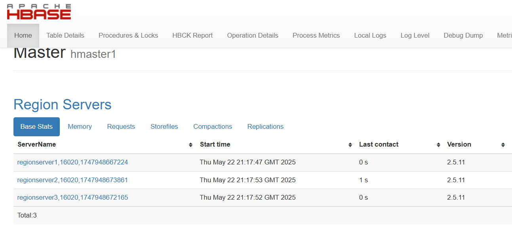
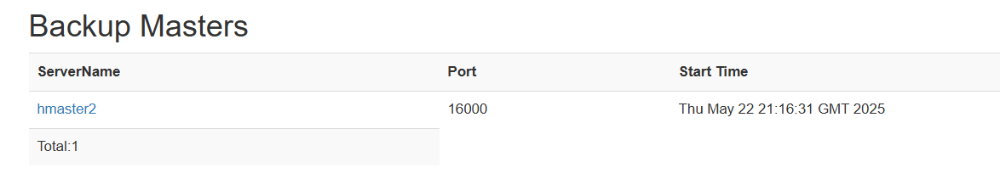
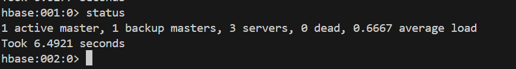
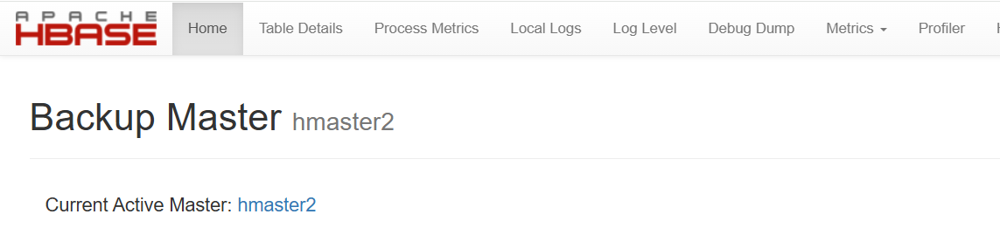
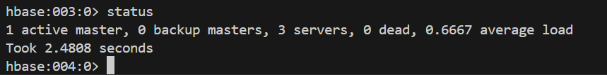

# 🐘 Hadoop High Availability Cluster with HBase on Docker

## 📦 Technologies Used

- **Docker & Docker Compose**
- **Hadoop 3.3.6**
- **Zookeeper (embedded in masters)**
- **HBase**
- **High Availability HDFS + YARN**
- **Multi-node HBase RegionServer Deployment**

## 🧱 Cluster Architecture

### 🗂 Hadoop Master Nodes
| Node     | Role                          | Ports                     |
|----------|-------------------------------|---------------------------|
| master1  | Active NameNode               | 9871, 8081, 2181          |
| master2  | Standby NameNode              | 9872, 8082, 2182          |
| master3  | Standby NameNode              | 9873, 8083, 2183          |

Each master also runs:
- JournalNode
- ResourceManager
- ZooKeeper instance

### 🧠 HBase Masters
| Node     | Role              | Ports         |
|----------|-------------------|---------------|
| hmaster1 | Active HBase      | 16010, 9090   |
| hmaster2 | Standby HBase     | 16020, 9091   |

### 📦 RegionServers
| Node         | Role          | Description                  |
|--------------|---------------|------------------------------|
| regionserver1| RegionServer  | Connected to all masters     |
| regionserver2| RegionServer  | Connected to all masters     |
| regionserver3| RegionServer  | Connected to all masters     |


## ⚙️ Getting Started

### 1. Clone the repository and prepare images

```bash
docker build -t hadoop-cluster:latest -f Dockerfile.hadoop .
docker build -t hbase-cluster:latest -f Dockerfile.hbase .
```

### 2. Start the cluster
```bash
docker compose up -d
```

### 3. Check running containers
```bash
docker compose ps
```

## 🔍 Access Web Interfaces

| Component      | URL                    |
|----------------|------------------------|
| HDFS (NN1)     | http://localhost:9871  |
| YARN (RM1)     | http://localhost:8081  |
| HBase Master   | http://localhost:16010 |
| HBase Thrift   | localhost:9090, localhost:9091 |

## 🛑 Shutdown

To stop and remove the entire cluster along with volumes:

```bash
docker compose down -v
```
## 📁 Directory Structure

```
project-root/
├── code/
├── hadoop/
│   ├── core-site.xml
│   ├── hdfs-site.xml
│   ├── mapred-site.xml
│   └── yarn-site.xml
├── hbase/
│   ├── backup-masters
│   ├── hbase-site.xml
│   └── regionservers
├── scripts/
│   ├── entrypoint.sh
│   └── hbase-entrypoint.sh
├── zookeeper/
│   └── zoo.cfg
├── docker-compose.yml
├── Dockerfile.hadoop
└── Dockerfile.hbase
```

## 🧪 Testing

### High Availability Test Plans


#### 1. HBase Master Failover Testing

This test plan outlines how to verify the automatic failover of the HBase Master.

1.  **Check active HBase master status before simulating failure:**

    **hmaster1** is active:
    
    *Image showing hmaster1 as the active master on the HBase UI.*

    **hmaster2** is backup:
    
    *Image showing hmaster2 as the standby master on the HBase UI.*

    Overall HBase Master status before failover:
    
    *Overall HBase Master status on the HBase UI before failover.*

2.  **Simulate HBase master failure:**
    Stop the active HBase master container (`hmaster1`).
    ```bash
    docker stop hmaster1
    ```

3.  **Check status after stopping hmaster1:**
    Verify that `hmaster2` has taken over as the active master.

    Now **hmaster2** is active:
    
    *Image showing hmaster2 is now the active master on the HBase UI.*

    
    *Another image confirming hmaster2 is the active master on the HBase UI.*

4.  **Restart failed master:**
    Start the previously stopped `hmaster1` container. It should rejoin as a standby master.
    ```bash
    docker start hmaster1
    ```
